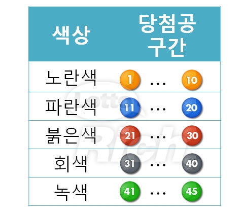

# 🎲로또 번호 생성기

## 언어

- HTML
- CSS
- JavaScript

## 기능

- 버튼을 눌렀을 때 중복이 없는 로또 번호 6개가  출력됨
- 6개의 번호는 오름차순으로 정렬되어 출력됨
- 당첨공 숫자 구간별로 색이 다름

  
- 사용자에게 정보를 받아 주어진 수량의 번호를 한번에 제공
- GitHub Pages 기능을 활용하여 배포

## 프로젝트 완성본

## 후기

